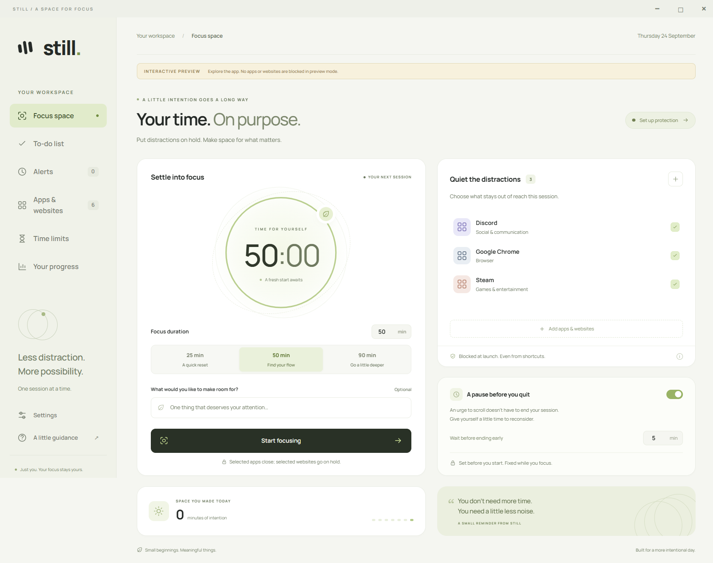
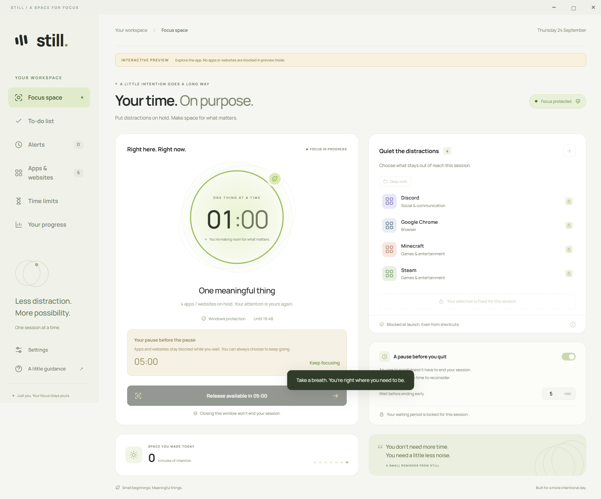
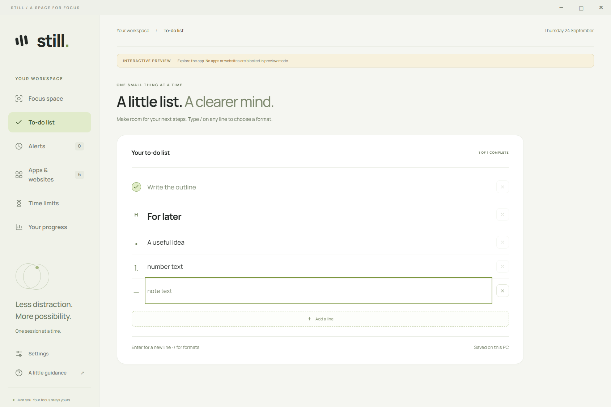
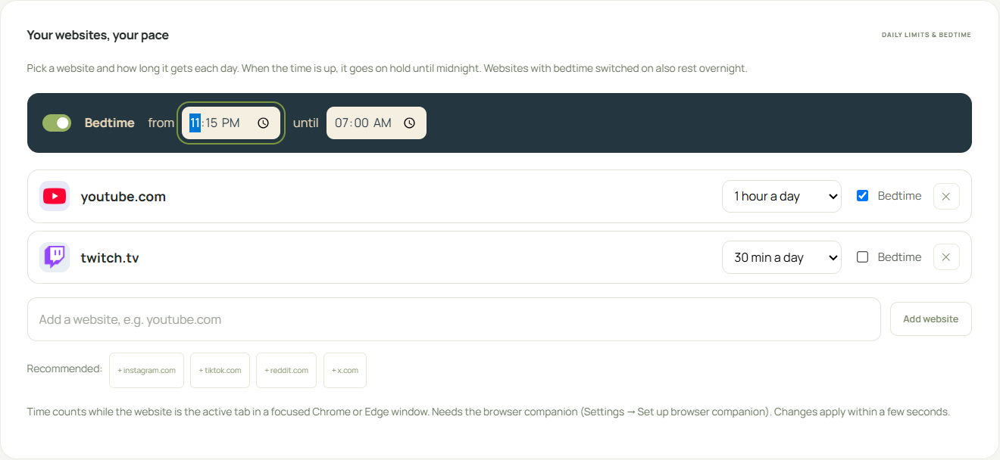
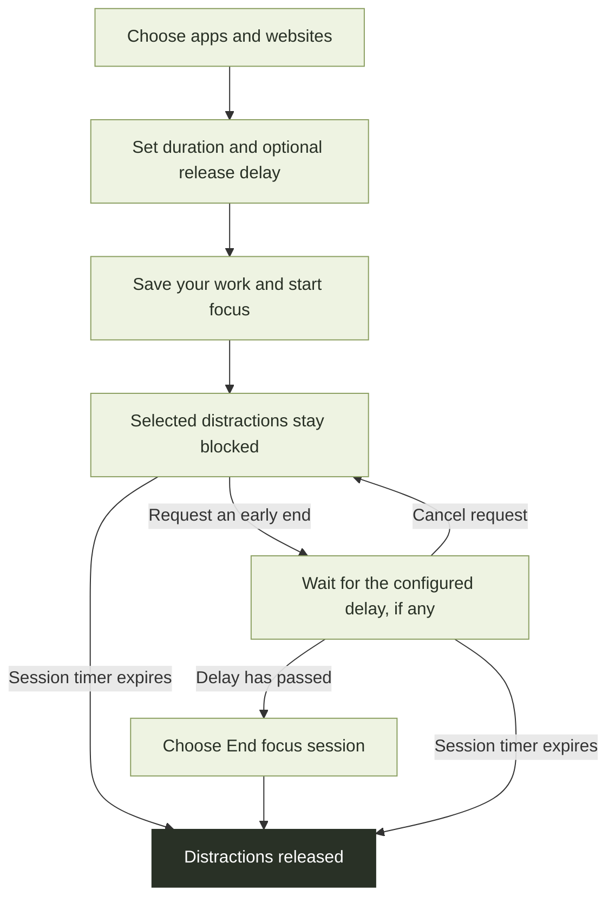

<div align="center">
  
  <h1>Still</h1>
  <p><strong>Your time. On purpose.</strong></p>
  <p>A quieter space for your attention.<br />Block distracting apps and websites, make a little plan, and settle into focus.</p>
  <p>
    <a href="https://stillfocus.fyi/home">Website</a> ·
    <a href="https://github.com/limpy183-dev/Still/releases/latest"><strong>Download for Windows</strong></a> ·
    <a href="#get-started">Get started</a> ·
    <a href="#take-a-look">Screenshots</a> ·
    <a href="docs/user-guide.md">User guide</a>
  </p>
  <p>Windows 10 / 11 · x64 · No account required · MIT licensed</p>
</div>

[](docs/images/focus-space.png)

*The real Still interface in demo mode. Screenshots use sample data; preview mode never blocks apps or websites. Click any screenshot to open it at full size.*

## A little more room for what matters

| Make space for… | What Still does |
| --- | --- |
| **Focused work** | Choose desktop apps, games, Store apps, and websites. Set a session from 1 minute to 24 hours. |
| **A pause before quitting** | Add an optional 1–120 minute wait before ending a session early. |
| **A quieter browser** | Block domains in Chrome and Edge, choose a block screen, and set daily website limits or bedtime. |
| **A small plan** | Keep a local to-do list with checkboxes, headings, notes, a keyboard-friendly `/` menu, and hold-to-select for bulk delete and reordering. |
| **A helpful reminder** | Schedule one-time, daily, or weekday alerts, with optional blocking, sounds, and media. |
| **Visible progress** | Review session history, daily charts, a calendar, and time spent on your intentions. Export history as JSON. |

[Get started](#get-started) · [Take a look](#take-a-look) · [How a session works](#how-a-session-works) · [Questions](#questions) · [Build and explore](#build-and-explore)

## Get started

1. **Install Still.** Download `Still-Setup-<version>.exe` from the [latest release](https://github.com/limpy183-dev/Still/releases/latest), run it, and choose **Install Still**. The app installs for your Windows account without administrator approval.
2. **Choose your distractions.** In Focus space, add apps or websites. For games, select the game's executable as well as its launcher. Save selections as reusable groups in the library.
3. **Prepare protection.** Enable **Windows protection** once; installing Still Guard requires administrator approval. For websites, also follow the [Chrome / Edge companion setup](docs/website-blocking.md#browser-setup).
4. **Set your intention and start.** Choose a duration and an optional release delay. Save your work first: starting a session closes selected running apps.

> **Windows requirements:** Updated Windows 10 version 2004+ or Windows 11, x64, Windows PowerShell 5.1, and .NET Framework 4.8. Still refuses domain-joined or detected MDM-managed PCs and PCs with existing application-control rules. See [protection and limits](docs/user-guide.md#protection-and-limits).

The build is **not code-signed**, so SmartScreen may show a warning. If you downloaded the release from this repository and want to proceed, choose **More info → Run anyway**. [Installation, updates, and removal →](docs/user-guide.md#install)

## Take a look

Expand a view to explore more of the app.

<details>
<summary><strong>Focus in progress — a pause before ending early</strong></summary>

The selection, duration, and release delay stay fixed during a session. Request release, wait, then explicitly end the session. You can cancel the request and keep focusing.

[](docs/images/active-session.png)

[Read about focus sessions →](docs/user-guide.md#use-the-windows-app)

</details>

<details>
<summary><strong>To-do list — a small plan beside your focus session</strong></summary>

Use `/` to choose a checkbox, tick circle, bullet, numbered item, heading, or note. Edits save automatically on your PC, including while you focus.

[](docs/images/todos.png)

[Learn the keyboard shortcuts →](docs/user-guide.md#to-do-list)

</details>

<details>
<summary><strong>Website limits — daily allowances and a bedtime window</strong></summary>

Choose a daily allowance and whether bedtime applies to each website. These limits work outside focus sessions and remain editable in Still.

[](docs/images/website-limits.png)

[Set up website blocking →](docs/website-blocking.md)

</details>

## How a session works



**Waiting does not automatically end a session.** Natural expiry always releases distractions, even if an early-release wait would have lasted longer. Cancelling a release request resets the wait for the next request.

Still Guard uses Windows AppLocker to deny app launches. The browser companion applies Chrome / Edge website rules. Closing the window hides Still in the tray; quitting the interface does not stop an active guard session. Session deadlines persist across Windows restarts. [Enforcement and recovery details →](docs/user-guide.md#protection-and-limits)

## Questions

<details>
<summary><strong>Can I try the interface without blocking anything?</strong></summary>

Yes. On Windows, clone the repository and run:

```powershell
git clone https://github.com/limpy183-dev/Still.git
cd Still
npm install
npm run demo
```

Use Node.js 22 and npm. The interactive demo uses simulated protection and separate preview data. It never blocks real apps or websites.

</details>

<details>
<summary><strong>What stays local, and what uses the network?</strong></summary>

Still has no accounts or telemetry, and its font is bundled locally. Preferences, to-dos, alerts, imported media, and history are stored on your PC. Website logos request selected domains from Google's favicon service and are cached locally. **Check for updates** contacts GitHub when you click it.

[Data storage and security →](docs/user-guide.md#data-and-security)

</details>

<details>
<summary><strong>Do alerts work after I close Still?</strong></summary>

Alerts work while Still is open or in the system tray. Quitting Still stops scheduling, and sleeping PCs are not woken. Enable launch at sign-in to resume scheduling after a restart. An active guard session continues independently.

[Alert modes, snooze behavior, and scheduling limits →](docs/user-guide.md#alerts)

</details>

<details>
<summary><strong>Is the lock unbreakable?</strong></summary>

No app can guarantee an unbreakable lock against the administrator of the same PC. Administrators can change services, policies, accounts, or the clock. Other browsers, modified executables, and alternative websites can bypass some controls. Still is a focus aid, and its interface makes these limits visible.

[Windows protection limits](docs/user-guide.md#protection-and-limits) · [Browser protection limits](docs/website-blocking.md#enforcement-and-recovery) · [Recovery and removal](docs/user-guide.md#recovery-and-removal)

</details>

## Build and explore

The [Still website](https://stillfocus.fyi/home) is served from `website/` by GitHub Pages. Changes to that folder on `main` deploy automatically through the **Deploy website** workflow; it can also be run manually from Actions. The site uses plain HTML, CSS, and JavaScript, with no install or build step. In repository **Settings → Pages**, the publishing source must be **GitHub Actions**. It is served at the custom domain `stillfocus.fyi` with clean URLs (`/home`, `/guide`, `/privacy`, ...): pages are linked without `.html`, and `index.html` only redirects to `/home`.

Still combines an **Electron interface**, a **C# Windows service**, **PowerShell AppLocker integration**, and a **Chrome / Edge companion**.

| I want to… | Start here |
| --- | --- |
| Install, update, or use Still | [User guide](docs/user-guide.md) |
| Set up browser blocking and time limits | [Website blocking](docs/website-blocking.md) |
| Run from source, build an installer, or run checks | [Development guide](docs/development.md) |
| Understand the code layout | [Source map](docs/development.md#source-map) |
| Try the Android preview (sessions, app and website blocking, daily limits, block screens, to-dos, history, alerts) | [Still for Android](docs/android.md) |
| Check enforcement validation limits | [Validation status](docs/development.md#develop-and-verify) |
| Report a bug or suggest an improvement | [GitHub issues](https://github.com/limpy183-dev/Still/issues) |

Live elevated service installation, kernel-enforced launch denial, and reboot recovery still need an administrator smoke test on a suitable Windows PC before relying on strict sessions. The [development guide](docs/development.md#develop-and-verify) includes the fixture-based smoke-test command.

## Code signing policy

Free code signing provided by [SignPath.io](https://about.signpath.io), certificate by [SignPath Foundation](https://signpath.org).

- Committers and reviewers: [limpy183-dev](https://github.com/limpy183-dev), [adambelalxd](https://github.com/adambelalxd)
- Approvers: [limpy183-dev](https://github.com/limpy183-dev), [adambelalxd](https://github.com/adambelalxd)

Only Still's own binaries are signed, built by the [release workflow](.github/workflows/release.yml) from this repository, and each release is approved by hand. Privacy: this program will not transfer any information to other networked systems unless specifically requested by the user or the person installing or operating it. See the [privacy page](https://stillfocus.fyi/privacy).

---

<div align="center">
  <p><strong>Less distraction. More possibility.</strong><br />One session at a time.</p>
  <p><a href="https://github.com/limpy183-dev/Still/releases/latest">Download Still</a> · <a href="LICENSE">MIT license</a></p>
</div>
