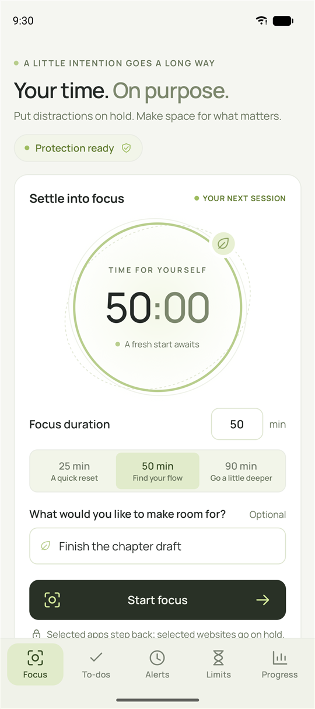
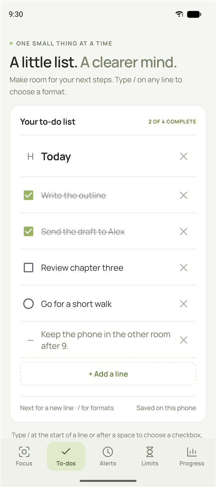
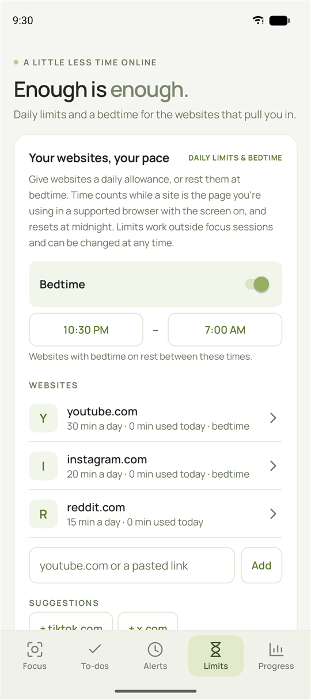
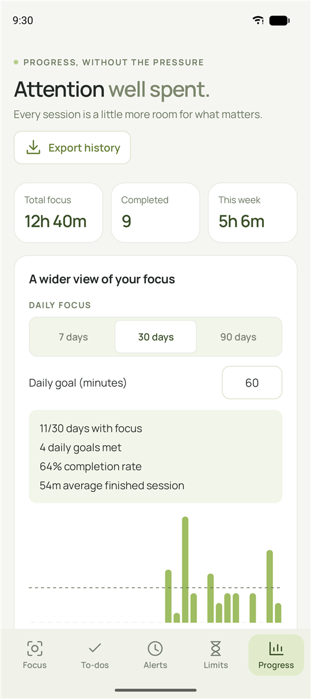

# Still for Android (preview)

[← Back to the overview](../README.md) · [User guide](user-guide.md) · [Development](development.md)

A native Android version of Still's focus sessions, in [`android/`](../android). So far: sessions, app and website blocking, a release delay, strict protection, the managed-phone check, daily website limits with bedtime, block screens, the to-do list, session history and alerts. Each [GitHub release](https://github.com/limpy183-dev/Still/releases/latest) includes a signed preview APK (`Still-Android-preview-X.Y.Z.apk`) for testing; it isn't a finished release.

Android 11 or newer. It is written in plain Java against the Android framework, with no libraries, so the release APK is about 260 KB, most of it the Manrope typeface.

<p>
  
  
  
  
</p>

*Screenshots from the Android emulator with sample data.*

## Look and navigation

The phone app uses the Windows app's design, fitted to a phone: the same Manrope typeface, quiet olive palette, paper panels, dark primary button and wording, with a dark theme that follows the phone's setting. A bar at the bottom holds the pages from the Windows sidebar: **Focus**, **To-dos**, **Alerts**, **Limits** and **Progress**. Back from any page returns to Focus; tapping the page you're on scrolls it to the top. The bar steps aside while the keyboard is open.

- **Focus** is the Windows focus page in one column: the timer ring with its orbits and floating leaf, the 25/50/90-minute presets, your intention and **Start focus**, then *Quiet the distractions* (apps and websites), *A pause before you quit* (release delay and strict protection), the block screen, *Space you made today* with the last seven days, and the small reminder card. A status pill at the top says whether protection is set up, ready or protecting a session.
- **During a session** the ring counts down and the glow breathes, the card shows your intention, end time and what's blocked, and *Your pause before the pause* holds the release request. The end button counts down to when release is available.
- **Animations** match Windows: pages rise and fade in, the leaf floats, the glow breathes while you focus, the status pill pulses, and buttons press down a pixel. They run only while the page is on screen, and Android's *Remove animations* setting switches them off.

## How a session works

It follows the Windows rules: a 1–1,440 minute session, an optional 1–120 minute release delay, and 1–100 apps and websites together (website-only sessions work too). To end early, request release, wait for the delay to pass, then choose **End focus session**. Cancelling a request means the next request waits the full delay again. When the session time runs out, apps and websites are always released.

| Windows | Android |
| --- | --- |
| Still Guard + AppLocker deny launches | An accessibility service sees a blocked app's window, sends it to the home screen, and covers it until it's gone |
| Refuses domain/MDM PCs and PCs with existing app-control policy | Refuses work profiles and phones with a device or profile owner |
| Essential Windows components can't be selected | Still, the home screen, Settings, phone, dialer, emergency apps, keyboards, the package installer and the system UI can't be selected. The list is checked again at block time. |
| Chrome/Edge companion blocks websites | Reads the address bar of supported browsers and steps back from blocked websites (see below) |
| Session deadlines survive restarts | The same. Deadlines also ignore date/time changes (see below). |
| `Still.Guard.exe --recover` | `adb shell am broadcast -n io.github.limpy183dev.still/.Recover` (see Recovery) |

**Protect Still during the session** (strict, on by default): Settings and uninstall screens that mention **Still Focus** are sent home until the session ends. This covers Still's App info (Force stop, Uninstall), its accessibility page and the uninstall prompt. Settings pages that don't mention Still, such as Wi-Fi, keep working.

## Websites

Type a domain or paste a link under **Websites to block**. Links are reduced to their domain, and the whole domain and its subdomains are blocked: youtube.com also covers m.youtube.com, but not notyoutube.com. Still accepts and rejects the same input as the Windows app (no IP addresses, wildcards, credentials or local names).

During a session with websites, Still reads the address bar of **Chrome** (and Beta, Dev, Canary), **Edge**, **Brave**, **Vivaldi**, **Firefox**, **Samsung Internet** and **DuckDuckGo**. This includes links opened from other apps in those browsers' in-app tabs. When a blocked website is open, Still goes back a page and shows the block screen (below). The browser stays usable for other websites, and nothing is blocked while you're typing in the address bar. Browsers Still can't read are blocked completely during sessions with websites, and are listed under **Blocked**, so they can't be used to get around it.

Why not a VPN or DNS filter? A local VPN would route every name lookup on the phone through Still, so any fault would break the whole internet. It would also take the phone's only VPN slot and could be skipped by Private DNS. Reading the address bar uses the service Still already runs, needs no new permission and fails open. The trade-off is that websites inside other apps' built-in web views aren't covered; block those apps instead. The Windows companion has the same scope: Chrome and Edge, not other apps.

## Block screens

When Still sends a blocked app home, or steps back from a blocked website, it shows a block screen until you tap **Close**. The blocked app or page is never behind it, because Home or Back has already been pressed. Choose the screen under **Change block screen** on the Focus page. The options match Windows' website block screens and use the same wording and colors as the browser companion's block page:

- **Quiet garden**, **Evening calm** or **A clean page**.
- **Your own screen**: your headline (120 characters), a few words (1,000 characters) and an optional JPG, PNG or WebP image. The image is picked with Android's file picker, so no storage permission is needed. It's shrunk and re-encoded once to at most 180 KB, the same budget as on Windows.
- **Redirect websites to a page**: blocked websites open an HTTPS page of your choice in the same browser. It must be outside the websites you block. Apps and Still's settings still show Quiet garden.

As on Windows, the chosen screen (and a copy of its image) is frozen into each session, so changing it during a session applies to the next one. The copy is deleted when the session ends, and history doesn't keep artwork. Daily limits and bedtime use the Windows limit page instead: *"That's enough for today."* and *"Time to rest."* A picture-in-picture window, which Home and Back can't close, gets a small plain cover instead.

## Daily limits and bedtime

Open **Limits** from the bar at the bottom, during a session or not. They follow the Windows rules. Give any website a daily allowance of 0–1,440 minutes (0 means no daily limit) and choose whether it rests at bedtime. One bedtime window applies to every website with bedtime on. The default is 22:30–07:00 and it may cross midnight. YouTube, Instagram, TikTok, Reddit and X are offered as suggestions. The settings are saved in the same JSON shape as `websiteLimits` in the Windows preferences.

Time counts only while a limited website is the page in the browser window you're using, with the screen on. When the allowance is used up, or bedtime starts, the site is stepped back from and a limit page is shown, like on Windows: *"That's enough for today. You've spent your 30 minutes on youtube.com today. It opens again at midnight."* or *"Time to rest. youtube.com is asleep until 7:00 AM."* Counts reset at local midnight. Bedtime and the daily count follow the phone's clock, so changing the date starts a new day, as on Windows. Limits work outside focus sessions and can be changed at any time, so they aren't protected by strict mode, matching Windows.

## To-do list

Open **To-dos** from the bar at the bottom, during a session or not. It works like the Windows list:

- **Formats:** type `/` at the start of a line or after a space to turn it into a checkbox, tick circle, bullet, numbered item, heading or note. The menu filters as you type ("/che", "/note"). Choosing a format removes the `/…` you typed.
- **Enter:** the keyboard's Next key (or Enter on a hardware keyboard) starts a new line with the text after the cursor, in the same format; a heading is followed by a checkbox.
- **Removing lines:** Backspace on an empty line removes it, and ✕ deletes any line. The list always keeps at least one line.
- **Moving lines:** drag a line's ⌃⌄ handle up or down. The line lifts and grows a little, the other lines glide out of its way, and it settles back when you let go, like on Windows. With TalkBack, use the handle's **Move up** and **Move down** actions.
- **Progress and limits:** checkboxes and tick circles count towards "N OF M COMPLETE". The list holds 500 lines of up to 2,000 characters.
- **Saving:** edits save automatically, at most every 0.4 seconds while typing and when you leave the screen. They use the same JSON shape as `todos` in the Windows preferences.

## Your progress

Open **Progress** from the bar at the bottom, during a session or not. It follows the Windows page:

- **At a glance:** total focus time, completed sessions, and focus time over the last seven days.

- **Daily focus:** the last 7, 30 or 90 days as bars, with your daily goal (1–1,440 minutes, default 60) as a dashed line, plus days with focus, daily goals met, completion rate and the average finished session. Time is split across local calendar days, completed sessions count on the day they finish, and recovered sessions add no focus time. The running session counts up to now.
- **Where your attention went:** focus time per intention over the chosen range, most time first.
- **Your sessions:** Unarchived, Archived or All, newest first, 20 at a time. **Archive** hides a session but keeps it in every figure; **Restore** brings it back; **Delete** asks first and removes it and its contribution for good. A change that can't be saved is undone.
- **Export history** saves `Still-sessions.json` wherever you choose, in the same shape as the Windows export.

Still keeps the last 500 sessions. The range and goal are saved as `progressDays` and `dailyGoal`, like the Windows preferences.

## Alerts

Open **Alerts** from the bar at the bottom, during a session or not. They follow the Windows rules and wording:

- **When:** once, every day or on weekdays, from a start date. An alert lasts a duration (1–1,440 minutes) or until an end time; an end time before the start time ends the next day, so it can cross midnight.
- **Styles:** **Full attention** fills the screen, over the lock screen, and turns the screen on. **Focus card** is a floating card at the bottom of the screen. Both play a sound on the alarm volume for up to a minute and close themselves after five minutes. **Quiet reminder** is a notification with your task and note, using the phone's notification sound (or none with **Silent**).
- **Sound and media:** Chime, Bloom, Bell and Pulse are the Windows sounds, or choose your own audio file. Alarm screens can show an image, animated GIF/WebP or a muted looping video. Files are picked with Android's file picker (no storage permission) and copied into Still, up to 200 MB each. Copies no alert uses are deleted a day later.
- **Snooze and Dismiss:** snooze for 5 minutes, as many times as you allow (0–100, or unlimited). **Show Dismiss** can be switched off, so the alarm needs **Let's focus** or a snooze. Back works like Dismiss.
- **Blocking:** an alert can block nothing, the apps and websites selected on the Focus page at the time it starts, or its own list. It starts a focus session that ends at the alert's end time, with the alert's release delay and the Focus page's strict setting. **Snooze releases the apps for 5 minutes** (the session is saved as *Snoozed*), then blocks them again until the end time if any remains. If another session is running, or app blocking is off, blocking starts as soon as that changes, if time remains.
- **Missed alerts:** if the phone was off for a whole alert, it's marked *Missed* instead of ringing late. If Still catches up while an alert's time is still running (after a restart, say), it rings with the time that's left.
- **Daylight saving and time zones:** times are local. A start time that doesn't exist on the night clocks go forward (02:30, say) rings at the same distance past the change (03:30); a time that happens twice when clocks go back rings once, at the first. A range across the change lasts an hour less or more, up to 25 hours. Changing time zone moves alerts to the new local time.

Still keeps 100 alerts. They are saved in `alerts.json` with the same fields as the Windows `alerts.json`.

Android shows alarm screens through a full-screen notification. With the screen off or locked, the screen opens at once. While you're using the phone, Android may show a heads-up notification instead (tap it to open the alarm); with app blocking switched on, Still can open the alarm screen directly. The notification has Snooze and Dismiss too. If notifications or full-screen notifications are switched off, the Alerts screen says so and links to the setting.

## Set up

1. Install the APK and open **Still Focus**.
2. Tap **Turn on app blocking** and switch on Still Focus under Accessibility. On Android 13+, for an APK not installed from a store, Android may say the setting is restricted. Open **App info → ⋮ → Allow restricted settings**, then try again.
3. Choose apps and websites, a duration and an optional release delay, then tap **Start focus**. Allow notifications to see the countdown in the notification shade.

## Safety and recovery

- **Fail open.** If anything goes wrong while blocking, Still removes its cover rather than leaving the phone stuck. If the saved state can't be read, nothing is blocked, and the damaged file is kept as `state.corrupt.json`.
- **Atomic saves with a backup.** `state.json` is written through Android's `AtomicFile`, which keeps `state.json.bak` until a write completes and restores it after a crash or power loss.
- **Never locked out.** A block screen appears only after the blocked app or page has been sent away, and **Close** always dismisses it. It is removed when the session ends, when the screen turns off and on any error. Protected apps (home screen, phone, Settings pages that don't mention Still) are never blocked.
- **Clock changes don't count.** Within one boot, deadlines use the uptime clock, so changing the date or time neither ends nor extends a session. After a reboot the wall clock is used again, capped at the session's own length.
- **Emergency release (USB debugging):** `adb shell am broadcast -n io.github.limpy183dev.still/.Recover` ends the session as *recovered* and keeps history. The receiver requires `android.permission.DUMP`, which only the system and the adb shell hold, so other apps can't send it.
- **Alerts can't lock you in.** A session an alert starts has a fixed end, capped at the alert's own window (25 hours at most), and the release delay and emergency release work as usual. Snooze and Dismiss can only be sent by Still's own notifications, and only for the alarm they belong to. Alerts are claimed and saved before anything rings or blocks, so a crash never repeats one. A damaged `alerts.json` is kept as `alerts.corrupt.json` and Still starts with no alerts.
- **Last resort: Safe mode.** Rebooting into Android's Safe mode switches off every downloaded app, including Still's blocking, without any help from Still.
- No cloud backup or phone-to-phone transfer (`allowBackup="false"` plus data extraction rules), so a running session is never restored onto another phone.

## Resource use

- **No session and no limits:** the accessibility service asks Android for no events at all, so it does no work. The process measured about 22 MB PSS and 0% CPU on a Pixel emulator.
- **During a session:** it receives only window changes (opening or switching apps), never content changes. It checks each change once, after an 80 ms settle. It re-checks every 0.7 s only while a supported browser is on screen during a website session (one address-bar lookup, measured at about 0.3% of one core), or while a Settings screen is open in a strict session (at most 400 items read). With no browser or Settings screen open, a session measured 0 CPU ticks over 10 s. With limits set and no session, a supported browser is checked once a second. Nothing is checked or counted while the screen is off.
- Limit usage is kept in memory and saved at most every 30 seconds, and when you leave the site or the screen turns off, so counting adds no disk work to each check.
- The countdown in the notification is drawn by the system. The countdown on the Focus page ticks once a second only while it is on screen during a session; the animations are GPU property animations that stop when you leave the page. The session end uses one inexact alarm. Blocking checks the clock itself, so a late alarm never delays release.
- Alerts use one exact alarm for the next thing due (a start, a snooze returning, or blocking to give up on) and nothing else: no polling and no background service. With no alerts there is no alarm. They are also checked when a session ends, blocking is switched on, the phone boots, the date, time or time zone changes, and Still is opened. Alarm sounds are synthesised once into a 3-second buffer the audio hardware loops. `USE_EXACT_ALARM` is granted at install on Android 13+; if exact alarms are ever denied, Still falls back to an inexact one.

## Limits

No app can make an unbreakable lock on a phone its owner controls. Safe mode, a factory reset, USB debugging or another user profile all get around Still, and these are deliberate ways back in. Picture-in-picture windows of a blocked app are covered where they are, not closed. Websites opened inside another app's built-in web view aren't seen. Browsers can rename their address-bar views in an update; the unit tests can't catch that, so check a browser update on a phone. Some phone makers' Settings apps may show Still's pages under a different app; report those as issues.

## Develop

```bash
cd android
./gradlew testDebugUnitTest assembleDebug
```

Gradle needs a JDK and the Android SDK (`ANDROID_HOME`). Android Studio's bundled JDK works (`JAVA_HOME="C:\Program Files\Android\Android Studio\jbr"`). The rules in `Session.java`, `Websites.java`, `Limits.java`, `BlockScreen.java`, `Todos.java`, `History.java` and `Alerts.java` are plain Java and are unit-tested on the JVM (`src/test`).

| File | What it does |
| --- | --- |
| `Session.java` | Session rules and deadlines (mirrors `native/Session.cs`) |
| `Websites.java` | Domain validation and matching (mirrors `app/websites.js`) and reading a host from an address bar |
| `BlockScreen.java`, `BlockScreenView.java`, `BlockScreenActivity.java` | Block screen rules (mirrors `presets`/`screen()`), drawing them, and the editor with a live preview |
| `Todos.java`, `TodosActivity.java` | To-do rules (mirrors `app/todos.js`) and the to-do screen |
| `History.java`, `HistoryActivity.java` | Progress figures (mirrors `focusMilliseconds`/`renderProgress`/`renderIntentions`) and the Your progress screen |
| `Limits.java`, `LimitStore.java`, `LimitsActivity.java` | Limit and bedtime rules (mirrors `limits`/`inBedtime`/`limitBlocks`), their storage and today's usage, and the Time limits screen |
| `Store.java` | Atomic state, history (500 entries) with archive/restore/delete, the end alarm and notifications |
| `BlockService.java` | The accessibility service that blocks apps and websites and protects Still in strict sessions |
| `Device.java` | Protected apps, supported browsers, the managed-phone check, whether blocking is switched on |
| `MainActivity.java` | The Focus page: set up a session, or watch and end the running one, with the timer ring |
| `Nav.java` | The bottom bar, page headings, edge-to-edge insets and the page entrance |
| `Alerts.java`, `AlertStore.java`, `AlertsActivity.java`, `AlertEditActivity.java` | Alert rules and times (mirrors `alert-domain.cjs`), storage and what happens when one is due (mirrors `alerts-main.cjs`), the list and the editor |
| `AlarmActivity.java`, `AlarmSound.java` | The alarm screens, notifications, Snooze/Dismiss, and the sounds (mirrors `alarm.html`/`alert-sound.js`) |
| `AppPicker.java` | The app list and picker shared by the Focus page and the alert editor |
| `Events.java`, `Recover.java` | End and alert alarms, boot, date/time/time-zone changes; emergency release |

Try it on an emulator with `adb install -r build/outputs/apk/debug/Still-debug.apk`. You can switch the service on without tapping through Settings:

```bash
adb shell settings put secure enabled_accessibility_services io.github.limpy183dev.still/.BlockService
```

## Changelog

The Android app isn't released yet, so its changes are listed here rather than on the website changelog.

- **Moving to-dos (2026-09-25, v1.0.7).** Drag a line's ⌃⌄ handle to move it, with the same lift, glide and settle animation as the Windows list.
- **The desktop look, and a bottom bar (2026-09-25).** Every page now uses the Windows app's design and wording: Manrope, the olive palette, paper panels, the timer ring with orbits and a floating leaf, 25/50/90-minute presets, the status pill, *Space you made today* and the reminder card, in light and dark themes. The pages moved from buttons on the main screen to a bar at the bottom (Focus, To-dos, Alerts, Limits, Progress). Progress gained total, completed and this-week figures. Page entrances, the breathing glow, the pulsing status and button presses are animated, and respect *Remove animations*.
- **Alerts and session history (2026-09-25).** Reminders and full alarms, alert-started sessions, and the Your progress page.
- **To-do list, block screens, daily limits and bedtime (2026-09-24–25).**
- **First preview (2026-09-24).** Sessions, app and website blocking, the release delay, strict protection, the managed-phone check and adb recovery.
